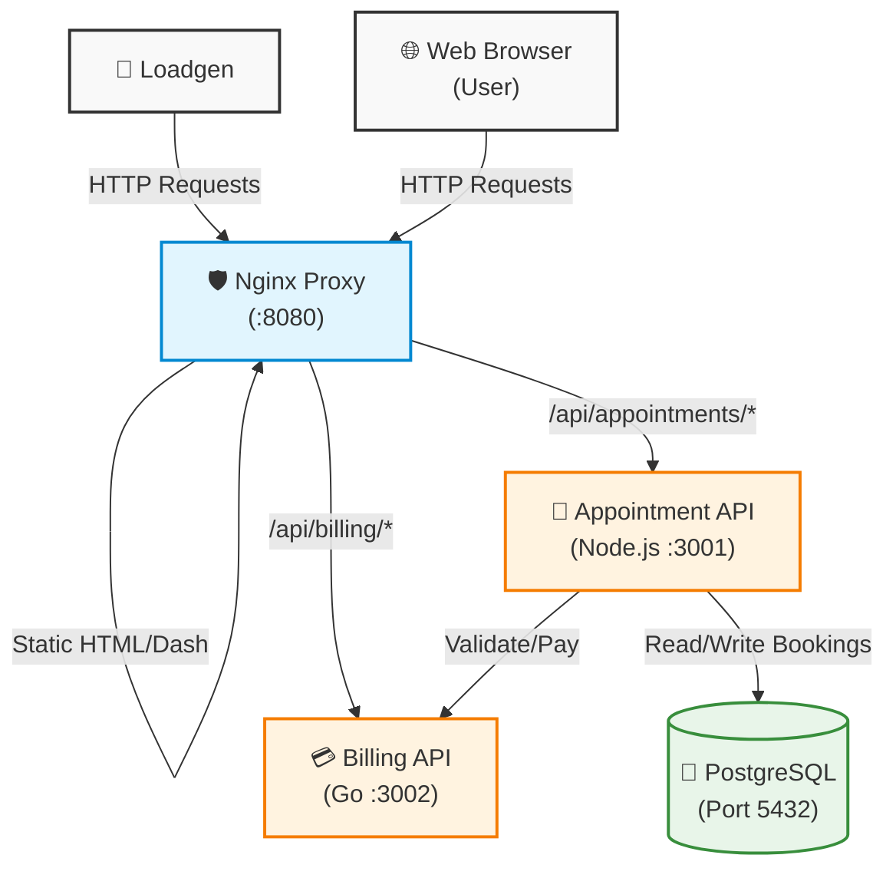

# 🏥 Mediora — APM Demo Application

A microservices healthcare web application purposefully designed for **testing, demonstrating, and validating Application Performance Monitoring (APM) tools**. 

Mediora simulates a realistic patient portal complete with distributed traces, database queries, and a configurable **Chaos Engine** to easily reproduce problem patterns, bottlenecks, and failures.

---

## 🏗 Architecture

The application is composed of multiple microservices, orchestrated via Docker Compose. Traffic is continuously generated by a headless Playwright bot to guarantee a steady stream of telemetry data.



### Component Breakdown
| Service | Technology | Role |
|---------|------------|------|
| **frontend** | Nginx + HTML/JS/Tailwind | Serves the static patient portal and reverse-proxies API requests. |
| **appointment-api** | Node.js / Express | Handles booking logic, interfaces with PostgreSQL, and forwards payments. |
| **billing-api** | Go / Gin | Processes mock payments with configurable failure rates. Highly optimized compiled binary relying purely on **Native Dynatrace OneAgent Monitoring** to unlock deeper backend insights like Goroutine analysis and CPU profiling. |
| **postgres** | PostgreSQL 15 | Persistent storage layer for appointment records. |
| **loadgen** | Playwright (Chromium) | Headless bot that drives continuous, realistic user traffic. |

---

## 🚦 Loadgen Personas

To ensure your APM receives realistic, continuous telemetry, the **Loadgen Bot** continuously cycles through 5 distinct user personas. This generates varied traces, statuses, and chaos triggers.

| Persona | User | Behavior & Flow |
|---------|------|-----------------|
| 😇 **The Perfect Patient** | Budi | Follows the happy path. *Login → Book Appointment → Pay → Success.* |
| 👀 **The Window Shopper** | Budi | Abandons the cart. *Login → Start Booking → Cancel → Dashboard.* |
| 🤒 **The Hypochondriac** | Siti | Obsessively checks records. *Login → Medical Records → View Record Detail.* |
| 💸 **The Broke Patient** | Siti | Encounters payment issues. *Login → Billing → Declined CC → Failed.* |
| 🌪️ **The Chaos Magnet** | John | Triggers the Chaos Engine. *Login → Book Dr. Chaos → Chaos Error.* |

---

## 🔥 Chaos Engine Configuration

Mediora includes a configurable Chaos Engine that injects specific problems into the microservices. This is controlled entirely via environment variables in `docker-compose.yml`—no code changes required.

### Global Chaos Variables

| Variable | Target Service | Description |
|----------|----------------|-------------|
| `MEDIORA_PROBLEMS` | appointment-api, billing-api | Comma-separated list of active problems. Leave empty (`""`) to disable. |
| `CHAOS_DELAY_SECONDS` | appointment-api, billing-api | Seconds after startup *before* chaos activates. Delays chaos to allow your APM to baseline normal traffic. |
| `LOADGEN_VPM` | loadgen | Visits Per Minute. Controls the intensity of the automated traffic (Default: `2`). |

### Available Problem Patterns

| Pattern Code | Service | Effect | Use Case |
|--------------|---------|--------|----------|
| `SlowDatabaseQuery` | appointment-api | Appends `SELECT pg_sleep(3)` to database queries, delaying responses by 3+ seconds. | Testing DB monitoring and timeout cascades. |
| `CpuSpike` | appointment-api | Forces a 500ms synchronous CPU thread burn before processing bookings. | Highlighting CPU bottlenecks and thread blocking. |
| `Billing500` | billing-api | Forces an HTTP 500 Internal Server Error at a 40% rate. | Testing error tracking, alerting, and SLA drops. |

---

## 🚀 Quick Start & Deployment

Start the entire stack, including the traffic generator and chaos engine, with a single command:

```bash
# 1. Clone the repository
git clone <repo-url>
cd mediora

# 2. Start the distributed trace environment
docker compose up --build -d
```

### Accessing the Portal
Once running, open **http://localhost:8080** in your browser. 
You can log in manually using the demo users:
- **User A (Budi)** - Clean slate.
- **User B (Siti)** - Historic data and bills.
- **User C (John)** - The Chaos User.

### Monitoring Logs
```bash
docker compose logs -f                    # Follow all services
docker compose logs -f loadgen            # Watch the bot cycle through Personas
docker compose logs -f appointment-api    # Monitor API traffic and Chaos injection
```

---

## 📂 Project Structure

```text
mediora/
├── docker-compose.yml          # Orchestration, Loadgen, and Chaos Engine Config
├── README.md                   # Project Documentation
├── .gitignore                  # Git ignore rules
├── .system_generated/          # Ignored: Internal artifacts (e.g., walkthroughs)
├── frontend/
│   ├── Dockerfile              # Nginx image configuration
│   ├── nginx.conf              # Reverse proxy routing rules
│   └── public/                 # Static HTML/JS frontend assets
│       ├── login.html
│       ├── dashboard.html
│       ├── booking.html
│       ├── billing.html
│       ├── records.html
│       ├── record-detail.html
│       ├── appointment-detail.html
│       ├── success.html
│       └── failed.html
├── services/
│   ├── appointment/            # Node.js + Express + Chaos
│   │   ├── Dockerfile
│   │   ├── package.json
│   │   └── server.js           # Handles bookings & PostgreSQL connections
│   ├── billing/                # Go + Gin + Chaos
│   │   ├── Dockerfile
│   │   ├── go.mod              # Go module definition
│   │   └── main.go             # Processes payments, simulates HTTP 500s
│   └── db/
│       └── init.sql            # PostgreSQL schema and seed data
└── loadgen/
    ├── Dockerfile              # Playwright Chromium environment
    ├── package.json
    └── bot.js                  # Playwright automation script executing 5 Personas
```

---

## 📜 License

This project is for educational and APM demonstration purposes.
